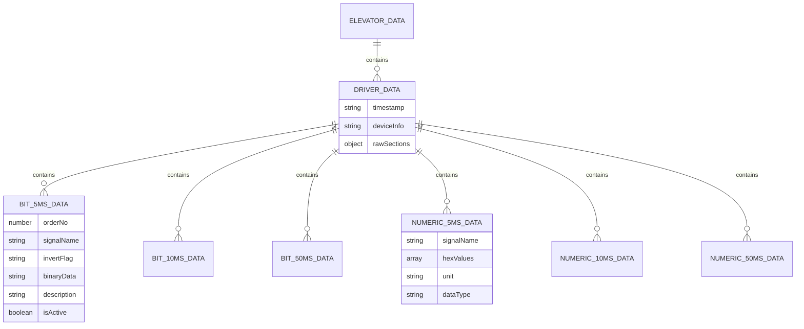
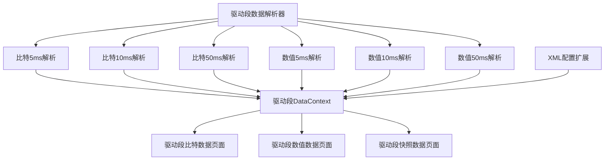
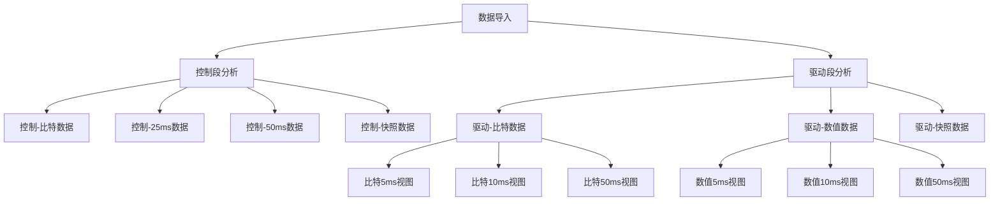

# 驱动段数据分析功能设计文档

## 1. 概述

基于现有的电梯控制系统数据跟踪分析工具，扩展驱动段数据分析功能。驱动段包含更高频率的数据采样（5ms、10ms）和不同类型的比特数据，需要在现有架构基础上增加对驱动段的解析和可视化支持。

### 1.1 功能目标

- 解析TXT文件中的驱动段数据
- 支持比特5ms、比特10ms、比特50ms数据的分析
- 支持数值5ms、数值10ms、数值50ms数据的展示
- 提供与控制段数据分析一致的用户体验
- 扩展现有的XML配置支持，适配驱动段信号描述

### 1.2 数据特点分析

从示例数据可以看出，驱动段包含以下数据类型：

```
驱动
2023/4/28 星期五 下午 3:34:27
比特5ms
比特10ms  
比特50ms
数值5ms
数值10ms
数值50ms
快照
```

相比控制段，驱动段具有更高的数据采样频率（5ms、10ms），需要特殊的处理和优化。

## 2. 架构设计

### 2.1 数据模型扩展

基于现有的数据模型，扩展以支持驱动段数据：



### 2.2 组件架构扩展



## 3. 数据类型定义

### 3.1 驱动段数据结构

```typescript
// 驱动段主数据结构
export interface DriverData {
  timestamp: string;
  deviceInfo: string;
  bit5msData: DriverBitSignal[];
  bit10msData: DriverBitSignal[];
  bit50msData: DriverBitSignal[];
  numeric5msData: DriverNumericData[];
  numeric10msData: DriverNumericData[];
  numeric50msData: DriverNumericData[];
  snapshotData: DriverSnapshotData[];
}

// 驱动段比特信号数据
export interface DriverBitSignal {
  orderNo: number;
  signalName: string;
  invertFlag: string | null;
  description: string;
  binaryData: string;
  isActive: boolean;
  hexValue: string;
  samplingRate: '5ms' | '10ms' | '50ms';
}

// 驱动段数值数据
export interface DriverNumericData {
  signalName: string;
  hexValues: string[];
  timestamps?: string[];
  unit?: string;
  dataType: '5ms' | '10ms' | '50ms';
  samplingRate: number; // 采样频率 Hz
}

// 驱动段快照数据
export interface DriverSnapshotData {
  timestamp: string;
  name: string;
  description: string;
  data: string;
  category: 'driver_snapshot';
  orderNo?: number;
}
```

### 3.2 数据存储状态扩展

```typescript
export interface DataStore {
  // 现有属性...
  currentData: ElevatorData | null;
  driverData: DriverData | null; // 新增驱动段数据
  xmlConfig: XMLConfig | null;
  isLoading: boolean;
  error: string | null;
  parseProgress: number;
  selectedSignals: string[];
  
  // 新增驱动段相关状态
  driverParseProgress: number;
  selectedDriverSignals: string[];
  driverViewMode: 'control' | 'driver'; // 切换视图模式
}
```

## 4. 解析器实现

### 4.1 驱动段解析器设计

扩展现有的`ElevatorDataParser`类，添加驱动段解析功能：

```typescript
export class DriverDataParser extends ElevatorDataParser {
  
  // 解析驱动段数据
  async parseDriverSection(content: string): Promise<DriverData> {
    const sections = this.splitDriverSections(content);
    
    return {
      timestamp: this.extractDriverTimestamp(content),
      deviceInfo: 'driver',
      bit5msData: this.parseDriverBitSection(sections.bit5ms, '5ms'),
      bit10msData: this.parseDriverBitSection(sections.bit10ms, '10ms'),
      bit50msData: this.parseDriverBitSection(sections.bit50ms, '50ms'),
      numeric5msData: this.parseDriverNumericSection(sections.numeric5ms, '5ms'),
      numeric10msData: this.parseDriverNumericSection(sections.numeric10ms, '10ms'),
      numeric50msData: this.parseDriverNumericSection(sections.numeric50ms, '50ms'),
      snapshotData: this.parseDriverSnapshotSection(sections.snapshot)
    };
  }
  
  // 分割驱动段各个子段
  private splitDriverSections(content: string): DriverSections {
    return {
      bit5ms: this.extractSection(content, /比特5ms[\s\S]*?(?=比特10ms|比特50ms|数值5ms|数值10ms|数值50ms|快照|管理|$)/),
      bit10ms: this.extractSection(content, /比特10ms[\s\S]*?(?=比特50ms|数值5ms|数值10ms|数值50ms|快照|管理|$)/),
      bit50ms: this.extractSection(content, /比特50ms[\s\S]*?(?=数值5ms|数值10ms|数值50ms|快照|管理|$)/),
      numeric5ms: this.extractSection(content, /数值5ms[\s\S]*?(?=数值10ms|数值50ms|快照|管理|$)/),
      numeric10ms: this.extractSection(content, /数值10ms[\s\S]*?(?=数值50ms|快照|管理|$)/),
      numeric50ms: this.extractSection(content, /数值50ms[\s\S]*?(?=快照|管理|$)/),
      snapshot: this.extractSection(content, /快照[\s\S]*?(?=管理|$)/)
    };
  }
  
  // 解析驱动段比特数据
  private parseDriverBitSection(content: string, samplingRate: '5ms' | '10ms' | '50ms'): DriverBitSignal[] {
    if (!content) return [];
    
    const lines = content.split('\n').filter(line => line.trim());
    const signals: DriverBitSignal[] = [];
    let orderNo = 0;
    
    lines.forEach((line, lineIndex) => {
      if (lineIndex === 0 || !line.trim()) return;
      
      // 解析比特数据行
      const parts = line.trim().split(/\s+/);
      
      if (parts.length >= 10) {
        // 标准两组数据格式
        this.addDriverBitSignal(signals, parts[0], parts.slice(1, 5), orderNo++, samplingRate);
        
        // 查找第二个信号名
        const secondSignalIndex = this.findSecondSignalIndex(parts, 5);
        if (secondSignalIndex === 5) {
          this.addDriverBitSignal(signals, parts[5], parts.slice(6, 10), orderNo++, samplingRate);
        }
      } else if (parts.length >= 5) {
        // 单组数据格式
        this.addDriverBitSignal(signals, parts[0], parts.slice(1), orderNo++, samplingRate);
      }
    });
    
    return signals;
  }
  
  // 解析驱动段数值数据
  private parseDriverNumericSection(content: string, dataType: '5ms' | '10ms' | '50ms'): DriverNumericData[] {
    if (!content) return [];
    
    const lines = content.split('\n').filter(line => line.trim());
    const data: DriverNumericData[] = [];
    
    lines.forEach((line, index) => {
      if (index === 0 || !line.trim()) return;
      
      const parts = line.trim().split(/\s+/);
      if (parts.length >= 2) {
        const signalName = parts[0];
        const hexValues = parts.slice(1);
        
        data.push({
          signalName,
          hexValues,
          dataType,
          unit: 'hex',
          samplingRate: this.getSamplingRateHz(dataType)
        });
      }
    });
    
    return data;
  }
  
  // 获取采样频率（Hz）
  private getSamplingRateHz(dataType: '5ms' | '10ms' | '50ms'): number {
    switch (dataType) {
      case '5ms': return 200; // 5ms = 200Hz
      case '10ms': return 100; // 10ms = 100Hz  
      case '50ms': return 20;  // 50ms = 20Hz
      default: return 20;
    }
  }
}
```

### 4.2 数据段标识符

驱动段使用以下标识符进行数据段分割：

| 标识符 | 描述 | 数据类型 |
|--------|------|----------|
| `驱动` | 驱动段开始标识 | 段标识 |
| `比特5ms` | 5毫秒周期比特数据 | 比特数据 |
| `比特10ms` | 10毫秒周期比特数据 | 比特数据 |
| `比特50ms` | 50毫秒周期比特数据 | 比特数据 |
| `数值5ms` | 5毫秒周期数值数据 | 数值数据 |
| `数值10ms` | 10毫秒周期数值数据 | 数值数据 |
| `数值50ms` | 50毫秒周期数值数据 | 数值数据 |

## 5. 用户界面设计

### 5.1 导航扩展

在现有侧边栏基础上，添加驱动段数据分析入口：



### 5.2 页面组件设计

#### 5.2.1 驱动段比特数据页面

基于现有的`BitData.tsx`设计，新增`DriverBitData.tsx`：

- **多标签页设计**：支持5ms、10ms、50ms三种采样频率的切换
- **高频数据优化**：针对5ms和10ms的高频数据，实现虚拟滚动
- **信号过滤增强**：按采样频率、信号类型进行筛选
- **性能监控**：显示数据量和渲染性能指标

#### 5.2.2 驱动段数值数据页面

基于现有的`Data25ms.tsx`和`Data50ms.tsx`设计，新增`DriverNumericData.tsx`：

- **频率选择器**：支持5ms、10ms、50ms数据的切换显示
- **图表优化**：针对高频数据优化图表渲染性能
- **数据密度控制**：提供数据抽样显示选项
- **实时更新**：支持数据的实时更新和滚动显示

#### 5.2.3 数据对比视图

新增控制段与驱动段的数据对比功能：

- **并排对比**：控制段和驱动段数据并排显示
- **时间同步**：基于时间戳同步显示数据
- **差异高亮**：突出显示控制段和驱动段的数据差异
- **联动操作**：选择操作在两个段之间联动

### 5.3 性能优化策略

#### 5.3.1 虚拟滚动实现

对于5ms和10ms的高频数据，实现虚拟滚动：

```typescript
interface VirtualScrollProps {
  items: DriverBitSignal[];
  itemHeight: number;
  containerHeight: number;
  renderItem: (item: DriverBitSignal, index: number) => ReactNode;
}

const VirtualScrollTable: React.FC<VirtualScrollProps> = ({
  items,
  itemHeight,
  containerHeight,
  renderItem
}) => {
  const [scrollTop, setScrollTop] = useState(0);
  
  const visibleStartIndex = Math.floor(scrollTop / itemHeight);
  const visibleEndIndex = Math.min(
    visibleStartIndex + Math.ceil(containerHeight / itemHeight) + 1,
    items.length
  );
  
  const visibleItems = items.slice(visibleStartIndex, visibleEndIndex);
  
  return (
    <div 
      style={{ height: containerHeight, overflow: 'auto' }}
      onScroll={(e) => setScrollTop(e.currentTarget.scrollTop)}
    >
      <div style={{ height: items.length * itemHeight, position: 'relative' }}>
        <div style={{ transform: `translateY(${visibleStartIndex * itemHeight}px)` }}>
          {visibleItems.map((item, index) => (
            <div key={visibleStartIndex + index} style={{ height: itemHeight }}>
              {renderItem(item, visibleStartIndex + index)}
            </div>
          ))}
        </div>
      </div>
    </div>
  );
};
```

#### 5.3.2 数据分页策略

```typescript
interface DataPaginationStrategy {
  pageSize: number;
  bufferSize: number;
  loadingThreshold: number;
}

const DRIVER_DATA_PAGINATION: Record<string, DataPaginationStrategy> = {
  '5ms': { pageSize: 100, bufferSize: 200, loadingThreshold: 50 },
  '10ms': { pageSize: 200, bufferSize: 400, loadingThreshold: 100 },
  '50ms': { pageSize: 500, bufferSize: 1000, loadingThreshold: 250 }
};
```

## 6. XML配置扩展

### 6.1 现有XML配置分析

通过深入分析现有的`AuxSubTableItem.xml`文件，发现系统已经包含了丰富的驱动段相关配置：

**控制段数据配置（已实现）：**
- `tableCode="0xD131数据内容"` - 控制段比特数据（256个配置项）
- `tableCode="0xD132数据内容(BIT TRACE)"` - 控制段比特跟踪数据（32个配置项）
- `tableCode="0xD132数据内容(SNATSHOT)"` - 控制段快照数据（284个配置项）

**驱动段数据配置（已存在）：**
- `tableCode="25ms TRACE"` - 25毫秒周期驱动数据（27个配置项）
- `tableCode="50ms TRACE"` - 50毫秒周期驱动数据（64个配置项）

**辅助配置数据：**
- `tableCode="P1故障代码Status"` - P1故障状态数据
- `tableCode="控制信号"` - 控制信号状态数据
- `tableCode="井道信号"` - 井道信号状态数据

### 6.2 25ms TRACE配置详细分析

25ms TRACE包含高频驱动控制数据，主要涵盖：

```xml
<!-- Pattern控制相关 -->
<AuxSubTableItem libId="default" tableCode="25ms TRACE" orderNo="3" 
  startPos="3" startCount="1" 
  itemCode="MP_PTMD   Patternmode  01：待機、02：ジャーク、03：加速、04：加速丸め、05：一定速、06：減速丸め、07：減速、08：着床、17：かご揺すり検知減速丸め、18：手動着床(緩停止)[%d]" 
  converterId="HexConverter"/>

<!-- 速度指令相关 -->
<AuxSubTableItem libId="default" tableCode="25ms TRACE" orderNo="4" 
  startPos="4" startCount="4" 
  itemCode="WQ_VPAT  制御 Pattern指令  0.01m/min/digit[%d]" 
  converterId="HexConverter"/>

<AuxSubTableItem libId="default" tableCode="25ms TRACE" orderNo="10" 
  startPos="28" startCount="4" 
  itemCode="WQ_VGTNR   タコ  0.01m/min/digit [%d]" 
  converterId="HexConverter"/>

<!-- 位置相关 -->
<AuxSubTableItem libId="default" tableCode="25ms TRACE" orderNo="7" 
  startPos="16" startCount="4" 
  itemCode="WP_SYNC  同步位置 1mm/digit[%d]" 
  converterId="HexConverter"/>

<!-- 门区信号 -->
<AuxSubTableItem libId="default" tableCode="25ms TRACE" orderNo="11" 
  startPos="32" startCount="1" 
  itemCode="MS_FDZ_LS( D3bit：DZU、D0bit：DZD) [%d]" 
  converterId="HexConverter"/>
```

### 6.3 50ms TRACE配置详细分析

50ms TRACE包含驱动状态和门控制数据：

```xml
<!-- 驱动状态 -->
<AuxSubTableItem libId="default" tableCode="50ms TRACE" orderNo="0" 
  startPos="0" startCount="1" 
  itemCode="MP_DRVMOD  运行状态   Service 00：没有启动、01：急停、02：正常停止、03：紧急減速、10：高速起动中、11：返平层启动中[%d]" 
  converterId="HexConverter"/>

<!-- 启动相关 -->
<AuxSubTableItem libId="default" tableCode="50ms TRACE" orderNo="1" 
  startPos="1" startCount="1" 
  itemCode="MP_TR_ANS  起動種別回答 00：没有启动、10：高速起动中、11：返平层运行中、[%d]" 
  converterId="HexConverter"/>

<AuxSubTableItem libId="default" tableCode="50ms TRACE" orderNo="2" 
  startPos="2" startCount="1" 
  itemCode="KP_RNGO  启动方向 00：停止检出、01：上行检出、02：下行检出[%d]" 
  converterId="HexConverter"/>

<!-- 门控制 -->
<AuxSubTableItem libId="default" tableCode="50ms TRACE" orderNo="10" 
  startPos="10" startCount="1" 
  itemCode="KP_FDOOR  轿厢１前 开门閉指令[%d]" 
  converterId="HexConverter"/>

<AuxSubTableItem libId="default" tableCode="50ms TRACE" orderNo="11" 
  startPos="11" startCount="1" 
  itemCode="KP_RDOOR  轿厢１后 开门閉指令[%d]" 
  converterId="HexConverter"/>
```

### 6.4 驱动段数据映射关系

基于XML配置分析，驱动段TXT数据与XML配置的映射关系：

**TXT驱动段数据类型 → XML tableCode映射：**

| TXT数据段 | XML tableCode | 配置项数量 | 数据特征 |
|-----------|---------------|------------|----------|
| 数值5ms | `25ms TRACE` | 27项 | 高频控制数据，包含Pattern指令、速度、位置 |
| 数值10ms | `25ms TRACE` | 27项 | 与5ms共享配置，但采样频率不同 |
| 数值25ms | `25ms TRACE` | 27项 | 标准25ms周期数据 |
| 数值50ms | `50ms TRACE` | 64项 | 驱动状态、门控制、SETS通信 |
| 比特5ms | 需扩展 | - | 高频比特状态数据 |
| 比特10ms | 需扩展 | - | 中频比特状态数据 |
| 比特50ms | `0xD131数据内容` | 256项 | 可复用现有比特配置 |
| 快照 | `0xD132数据内容(SNATSHOT)` | 284项 | 可复用现有快照配置 |

**关键发现：**
1. XML中`25ms TRACE`实际对应TXT中的数值5ms/10ms/25ms数据
2. XML中`50ms TRACE`对应TXT中的数值50ms数据
3. 比特5ms和比特10ms需要新的XML配置
4. 比特50ms可以复用`0xD131数据内容`的配置
5. 快照数据可以复用`0xD132数据内容(SNATSHOT)`的配置

### 6.5 配置解析器扩展

基于现有XML结构，扩展配置解析器以支持驱动段数据：

```typescript
export interface DriverXMLConfig extends XMLConfig {
  // 现有的驱动段相关配置
  ms25TraceItems: AuxSubTableItem[];  // tableCode="25ms TRACE"
  ms50TraceItems: AuxSubTableItem[];  // tableCode="50ms TRACE"
  
  // 复用控制段配置支持驱动段
  controlBitItems: AuxSubTableItem[];     // tableCode="0xD131数据内容"
  controlSnapshotItems: AuxSubTableItem[]; // tableCode="0xD132数据内容(SNATSHOT)"
  
  // 辅助状态配置
  p1StatusItems: AuxSubTableItem[];       // tableCode="P1故障代码Status"
  controlSignalItems: AuxSubTableItem[];  // tableCode="控制信号"
  wellSignalItems: AuxSubTableItem[];     // tableCode="井道信号"
}

export class DriverXMLConfigParser extends XMLConfigParser {
  parseDriverXMLConfig(xmlContent: string): DriverXMLConfig {
    const baseConfig = this.parseXMLConfig(xmlContent);
    
    return {
      ...baseConfig,
      // 驱动段专用配置
      ms25TraceItems: this.filterByTableCode(baseConfig.items, '25ms TRACE'),
      ms50TraceItems: this.filterByTableCode(baseConfig.items, '50ms TRACE'),
      
      // 复用控制段配置
      controlBitItems: this.filterByTableCode(baseConfig.items, '0xD131数据内容'),
      controlSnapshotItems: this.filterByTableCode(baseConfig.items, '0xD132数据内容(SNATSHOT)'),
      
      // 辅助配置
      p1StatusItems: this.filterByTableCode(baseConfig.items, 'P1故障代码Status'),
      controlSignalItems: this.filterByTableCode(baseConfig.items, '控制信号'),
      wellSignalItems: this.filterByTableCode(baseConfig.items, '井道信号')
    };
  }
  
  // 获取驱动段信号描述（根据数据类型自动选择配置）
  getDriverSignalDescription(
    signalName: string, 
    orderNo: number,
    dataType: 'numeric5ms' | 'numeric10ms' | 'numeric25ms' | 'numeric50ms' | 'bit5ms' | 'bit10ms' | 'bit50ms' | 'snapshot'
  ): string {
    let items: AuxSubTableItem[] = [];
    
    // 根据数据类型选择对应的配置
    switch (dataType) {
      case 'numeric5ms':
      case 'numeric10ms':
      case 'numeric25ms':
        items = this.ms25TraceItems;
        break;
      case 'numeric50ms':
        items = this.ms50TraceItems;
        break;
      case 'bit5ms':
      case 'bit10ms':
      case 'bit50ms':
        items = this.controlBitItems; // 复用控制段比特配置
        break;
      case 'snapshot':
        items = this.controlSnapshotItems; // 复用控制段快照配置
        break;
    }
    
    // 优先按orderNo匹配
    const orderItem = items.find(item => item.orderNo === orderNo);
    if (orderItem) {
      return this.parseItemCodeDescription(orderItem.itemCode);
    }
    
    // 如果找不到，尝试按信号名匹配
    const nameMatch = items.find(item => 
      this.extractSignalName(item.itemCode).toLowerCase().includes(signalName.toLowerCase())
    );
    
    return nameMatch ? this.parseItemCodeDescription(nameMatch.itemCode) : `未知信号: ${signalName}`;
  }
  
  // 解析itemCode描述，处理参数化标记
  private parseItemCodeDescription(itemCode: string): string {
    // 处理[%d]参数化标记
    return itemCode.replace(/\[%d\]/g, '').trim();
  }
  
  // 从 itemCode 中提取信号名
  private extractSignalName(itemCode: string): string {
    // 提取信号名（通常在第一个空格之前）
    const match = itemCode.match(/^([A-Z_]+[A-Z0-9_]*)/i);
    return match ? match[1] : itemCode.split(' ')[0];
  }
}
```

### 6.6 信号描述匹配策略

针对不同的数据类型，采用不同的匹配策略：

**25ms TRACE数据（驱动数值5ms/10ms/25ms）：**
- 使用`orderNo`索引匹配（第一优先级）
- 支持参数化描述（如`[%d]`）
- 包含精度信息（如`0.01m/min/digit`、`1mm/digit`）
- 优先匹配信号名（如`WQ_VPAT`、`WP_SYNC`）

**50ms TRACE数据（驱动数值50ms）：**
- 按`orderNo`匹配，信号名辅助验证
- 包含状态枚举值描述（如运行状态码）
- 支持复杂的指令描述（如门控制、启动方向）

**比特数据（驱动比特5ms/10ms/50ms）：**
- 复用`0xD131数据内容`配置（256项）
- 按信号名精确匹配优先
- 支持反转标记`*-`的处理
- 包含状态描述（如`[ON:1]`、`[异常:0]`）

**快照数据（驱动快照）：**
- 复用`0xD132数据内容(SNATSHOT)`配置（284项）
- 结合`orderNo`和信号名匹配
- 支持单位和精度信息解析
- 处理复杂信号名（如`strSEIKU1.VP_PTMD`）

**匹配优先级：**
1. 精确的`orderNo`匹配
2. 信号名前缀匹配
3. 部分信号名匹配
4. 默认未知信号描述

## 7. 状态管理扩展

### 7.1 DataContext扩展

```typescript
// 新增Action类型
export type DriverDataAction =
  | { type: 'SET_DRIVER_DATA'; payload: DriverData }
  | { type: 'SET_DRIVER_LOADING'; payload: boolean }
  | { type: 'SET_DRIVER_PROGRESS'; payload: number }
  | { type: 'SELECT_DRIVER_SIGNALS'; payload: string[] }
  | { type: 'SET_DRIVER_VIEW_MODE'; payload: 'control' | 'driver' }
  | { type: 'CLEAR_DRIVER_DATA' };

// DataContext方法扩展
export interface DataContextType {
  // 现有方法...
  
  // 驱动段数据方法
  setDriverData: (data: DriverData) => void;
  getDriverBit5msData: () => DriverBitSignal[];
  getDriverBit10msData: () => DriverBitSignal[];
  getDriverBit50msData: () => DriverBitSignal[];
  getDriverNumeric5msData: () => DriverNumericData[];
  getDriverNumeric10msData: () => DriverNumericData[];
  getDriverNumeric50msData: () => DriverNumericData[];
  getDriverSnapshotData: () => DriverSnapshotData[];
  
  // 信号描述获取（驱动段）
  getDriverSignalDescription: (
    signalName: string, 
    samplingRate: '5ms' | '10ms' | '50ms',
    dataType: 'bit' | 'numeric'
  ) => string;
}
```

### 7.2 Reducer扩展

```typescript
function driverDataReducer(state: DataStore, action: DriverDataAction): DataStore {
  switch (action.type) {
    case 'SET_DRIVER_DATA':
      return {
        ...state,
        driverData: action.payload,
        driverParseProgress: 100
      };
      
    case 'SET_DRIVER_LOADING':
      return {
        ...state,
        isLoading: action.payload
      };
      
    case 'SET_DRIVER_PROGRESS':
      return {
        ...state,
        driverParseProgress: action.payload
      };
      
    case 'SELECT_DRIVER_SIGNALS':
      return {
        ...state,
        selectedDriverSignals: action.payload
      };
      
    case 'SET_DRIVER_VIEW_MODE':
      return {
        ...state,
        driverViewMode: action.payload
      };
      
    case 'CLEAR_DRIVER_DATA':
      return {
        ...state,
        driverData: null,
        driverParseProgress: 0,
        selectedDriverSignals: []
      };
      
    default:
      return state;
  }
}
```

## 8. 路由配置

### 8.1 路由结构扩展

```typescript
// 新增驱动段相关路由
const driverRoutes = [
  {
    path: '/driver',
    element: <DriverLayout />,
    children: [
      { path: 'bit-data', element: <DriverBitData /> },
      { path: 'numeric-data', element: <DriverNumericData /> },
      { path: 'snapshot-data', element: <DriverSnapshotData /> },
      { path: 'compare', element: <DriverControlCompare /> }
    ]
  }
];
```

### 8.2 导航菜单扩展

```typescript
const navigationMenus = [
  {
    title: '数据导入',
    path: '/import',
    icon: <Upload />
  },
  {
    title: '控制段分析',
    path: '/control',
    icon: <Settings />,
    children: [
      { title: '比特数据', path: '/control/bit-data' },
      { title: '25ms数据', path: '/control/data-25ms' },
      { title: '50ms数据', path: '/control/data-50ms' },
      { title: '快照数据', path: '/control/snapshot' }
    ]
  },
  {
    title: '驱动段分析',
    path: '/driver',
    icon: <Zap />,
    children: [
      { title: '比特数据', path: '/driver/bit-data' },
      { title: '数值数据', path: '/driver/numeric-data' },
      { title: '快照数据', path: '/driver/snapshot-data' },
      { title: '对比分析', path: '/driver/compare' }
    ]
  }
];
```

## 9. 实现计划

### 9.1 开发阶段

**第一阶段：数据解析器实现（预计3天）**
- 扩展现有解析器，支持驱动段数据识别
- 实现驱动段各子段的解析逻辑
- 添加数据验证和错误处理

**第二阶段：数据模型和状态管理（预计2天）**
- 扩展TypeScript类型定义
- 实现驱动段数据的状态管理
- 测试数据流和状态更新

**第三阶段：用户界面实现（预计5天）**
- 实现驱动段比特数据页面
- 实现驱动段数值数据页面
- 实现虚拟滚动和性能优化
- 添加导航和路由支持

**第四阶段：对比功能和优化（预计3天）**
- 实现控制段与驱动段的对比功能
- 性能优化和测试
- 用户体验改进

### 9.2 技术风险评估

| 风险项 | 影响程度 | 解决方案 |
|--------|----------|----------|
| 高频数据渲染性能 | 高 | 实现虚拟滚动，数据分页 |
| 内存占用过大 | 中 | 数据懒加载，及时清理 |
| XML配置复杂性 | 中 | 分阶段实现，保持向后兼容 |
| 用户学习成本 | 低 | 保持UI一致性，添加引导 |

### 9.3 测试策略

**单元测试**
- 驱动段解析器功能测试
- 数据模型验证测试
- 状态管理逻辑测试

**集成测试**
- 端到端数据流测试
- 用户界面交互测试
- 性能压力测试

**用户测试**
- 可用性测试
- 功能完整性测试
- 跨浏览器兼容性测试

## 10. 性能监控与优化

### 10.1 性能指标

- **数据解析时间**：目标 < 2秒（10MB文件）
- **页面渲染时间**：目标 < 500ms
- **内存使用**：目标 < 100MB（处理大文件时）
- **滚动流畅度**：目标 60fps

### 10.2 监控实现

```typescript
interface PerformanceMetrics {
  parseTime: number;
  renderTime: number;
  memoryUsage: number;
  dataSize: number;
}

export class PerformanceMonitor {
  private metrics: PerformanceMetrics = {
    parseTime: 0,
    renderTime: 0,
    memoryUsage: 0,
    dataSize: 0
  };
  
  startParseTimer(): void {
    this.parseStartTime = performance.now();
  }
  
  endParseTimer(): void {
    this.metrics.parseTime = performance.now() - this.parseStartTime;
  }
  
  measureMemoryUsage(): void {
    if ('memory' in performance) {
      this.metrics.memoryUsage = (performance as any).memory.usedJSHeapSize;
    }
  }
  
  reportMetrics(): PerformanceMetrics {
    return { ...this.metrics };
  }
}
```

通过这个设计文档，驱动段数据分析功能将无缝集成到现有系统中，为用户提供控制段和驱动段的完整数据分析体验。