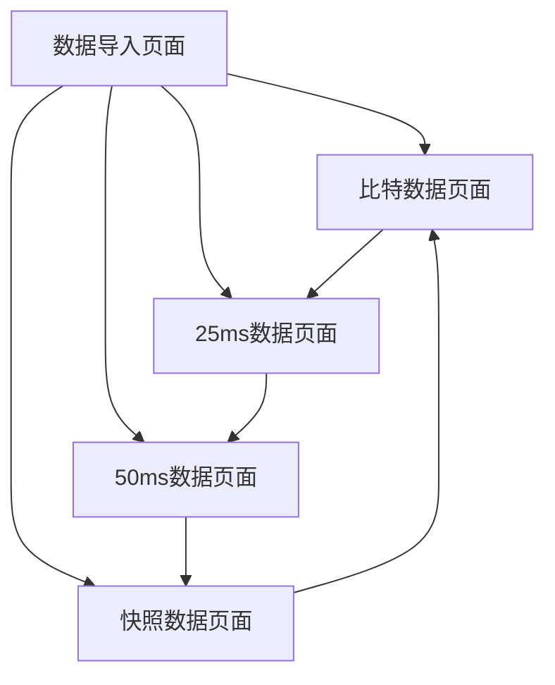

# 电梯控制系统数据跟踪分析工具 - 产品需求文档

## 1. 产品概述

电梯控制系统数据跟踪分析工具是一个专业的数据分析平台，用于处理和分析电梯控制系统的运行数据。该工具能够导入TXT格式的电梯控制数据文件，并将数据分类展示为比特数据、25ms数据、50ms数据和快照数据四个部分，帮助工程师快速定位和分析电梯系统的运行状态和故障信息。

产品主要解决电梯维护工程师在数据分析过程中的效率问题，通过直观的网页界面和结构化的数据展示，大幅提升故障诊断和系统监控的工作效率。该产品面向电梯维护工程师和技术人员，旨在成为电梯行业数据分析的专业工具。

## 2. 核心功能

### 2.1 用户角色

| 角色 | 注册方式 | 核心权限 |
|------|----------|----------|
| 维护工程师 | 直接访问 | 可导入数据、查看所有数据分析结果、导出分析报告 |

### 2.2 功能模块

本产品包含以下主要页面：
1. **数据导入页面**：文件上传功能、数据解析状态显示、文件格式验证
2. **比特数据页面**：比特信号状态表格、信号解释显示、信号筛选功能
3. **25ms数据页面**：25毫秒周期数值数据表格、时序图表、数据导出
4. **50ms数据页面**：50毫秒周期数值数据表格、时序图表、数据导出
5. **快照数据页面**：系统状态快照表格、关键时刻数据、快照对比功能

### 2.3 页面详情

| 页面名称 | 模块名称 | 功能描述 |
|----------|----------|----------|
| 数据导入页面 | 文件上传模块 | 支持TXT文件拖拽上传，显示文件解析进度和状态，验证文件格式 |
| 数据导入页面 | 数据预览模块 | 显示导入文件的基本信息、数据段统计、解析结果概览 |
| 数据导入页面 | XML配置加载 | 自动加载AuxSubTableItem.xml配置文件，用于信号解释 |
| 比特数据页面 | 信号状态表格 | 显示NO顺序、信号反转标记、信号名、信号解释、32位数据，支持排序 |
| 比特数据页面 | 信号筛选模块 | 支持按信号名、状态值、信号类型进行筛选和搜索 |
| 比特数据页面 | 信号解释显示 | 结合XML配置显示详细的信号含义和状态说明 |
| 25ms数据页面 | 数值数据表格 | 显示25ms周期采样的所有数值数据，支持分页和列排序 |
| 25ms数据页面 | 时序图表模块 | 提供数据的时序变化趋势图表，支持缩放和数据点查看 |
| 25ms数据页面 | 数据导出功能 | 支持将数据导出为CSV或Excel格式 |
| 50ms数据页面 | 数值数据表格 | 显示50ms周期采样的所有数值数据，支持分页和列排序 |
| 50ms数据页面 | 时序图表模块 | 提供数据的时序变化趋势图表，支持缩放和数据点查看 |
| 50ms数据页面 | 数据导出功能 | 支持将数据导出为CSV或Excel格式 |
| 快照数据页面 | 快照数据表格 | 显示关键时刻的系统状态快照，按时间顺序排列 |
| 快照数据页面 | 快照对比模块 | 支持多个快照之间的数据对比分析，高亮显示差异 |
| 快照数据页面 | 快照详情查看 | 点击快照可查看详细的系统状态信息 |

## 3. 核心流程

用户操作流程如下：
1. 用户访问系统首页，自动跳转到数据导入页面
2. 用户上传TXT格式的电梯控制数据文件（如苏州中海数据跟踪控制.txt）
3. 系统自动解析文件，识别"控制"、"比特"、"数值25ms"、"数值50ms"、"快照"五个数据段
4. 系统加载AuxSubTableItem.xml配置文件，用于比特数据的信号解释
5. 用户通过左侧导航栏切换到不同的数据分析页面
6. 在比特数据页面查看信号状态，每个信号显示NO顺序、反转标记、信号名和解释
7. 在25ms/50ms数据页面查看数值数据表格和时序变化图表
8. 在快照数据页面查看关键时刻的系统状态，支持快照间对比
9. 用户可导出分析结果用于进一步处理

## 4. 用户界面设计

### 4.1 设计风格

- **主色调**：深蓝色(#1f2937)作为主色，浅蓝色(#3b82f6)作为辅助色
- **按钮样式**：圆角矩形按钮，悬停时有阴影效果和颜色变化
- **字体**：主要使用微软雅黑14px，数据表格使用等宽字体Consolas 12px
- **布局风格**：左侧固定导航栏(240px宽) + 右侧内容区域的经典布局
- **图标风格**：使用Heroicons线性图标，支持数据分析和工程主题

### 4.2 页面设计概览

| 页面名称 | 模块名称 | UI元素 |
|----------|----------|--------|
| 数据导入页面 | 文件上传模块 | 虚线边框拖拽区域，支持文件格式验证，蓝色进度条显示解析状态 |
| 数据导入页面 | 数据预览模块 | 白色卡片式布局，显示文件名、大小、解析时间、数据段统计 |
| 数据导入页面 | XML配置状态 | 绿色指示器显示XML配置加载状态，红色表示加载失败 |
| 比特数据页面 | 信号状态表格 | 响应式表格，表头固定，信号状态用绿色(1)/灰色(0)区分 |
| 比特数据页面 | 信号筛选模块 | 顶部搜索框和下拉筛选器，实时过滤表格数据 |
| 比特数据页面 | 信号解释显示 | 悬停显示详细解释，重要信号用橙色标记 |
| 25ms数据页面 | 数值数据表格 | 分页表格(每页50行)，支持列宽调整和数据排序 |
| 25ms数据页面 | 时序图表模块 | Chart.js折线图，支持缩放、平移和数据点悬停显示 |
| 25ms数据页面 | 数据导出功能 | 右上角导出按钮，支持CSV和Excel格式 |
| 50ms数据页面 | 数值数据表格 | 分页表格(每页50行)，支持列宽调整和数据排序 |
| 50ms数据页面 | 时序图表模块 | Chart.js折线图，支持缩放、平移和数据点悬停显示 |
| 50ms数据页面 | 数据导出功能 | 右上角导出按钮，支持CSV和Excel格式 |
| 快照数据页面 | 快照数据表格 | 时间轴式布局，每个快照显示为独立的白色卡片 |
| 快照数据页面 | 快照对比模块 | 并排对比视图，差异数据用黄色背景高亮显示 |
| 快照数据页面 | 快照详情查看 | 模态框显示完整的快照数据，支持JSON格式查看 |

### 4.3 响应式设计

产品采用桌面优先的设计策略，主要面向工程师在PC端使用。支持1920x1080及以上分辨率的最佳显示效果，同时兼容1366x768的基本显示需求。左侧导航栏在屏幕宽度小于1024px时可收缩为图标模式，表格在小屏幕下支持水平滚动。