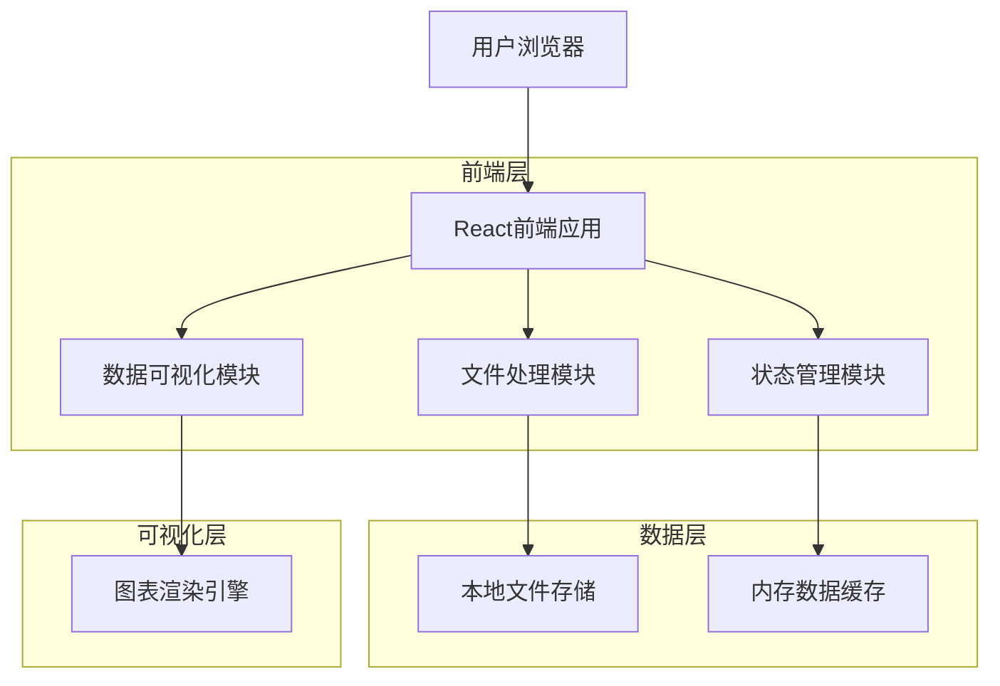
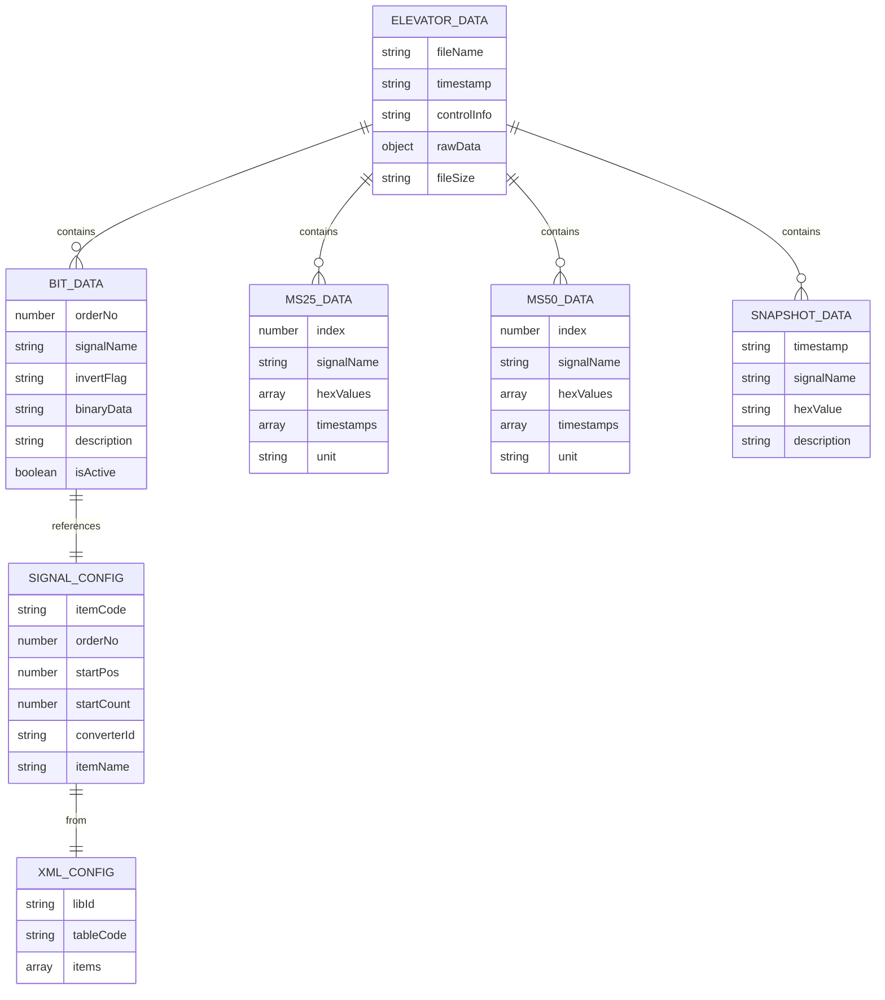

# 电梯控制系统数据跟踪分析工具 - 技术架构文档

## 1. 架构设计



## 2. 技术描述

- **前端**: React@18 + TypeScript + Tailwind CSS + Vite
- **数据可视化**: Chart.js + React-Chartjs-2
- **文件处理**: 原生File API + 自定义TXT解析器 + XML解析器
- **状态管理**: React Context + useReducer
- **UI组件**: Headless UI + 自定义组件库
- **图标**: Heroicons
- **数据导出**: SheetJS (xlsx) + CSV生成器
- **后端**: 无（纯前端应用）

## 3. 路由定义

| 路由 | 用途 |
|------|------|
| / | 首页，自动重定向到数据导入页面 |
| /import | 数据导入页面，支持TXT文件上传和解析 |
| /bit-data | 比特数据页面，显示信号状态和XML配置解释 |
| /data-25ms | 25ms数据页面，显示数值数据表格和时序图表 |
| /data-50ms | 50ms数据页面，显示数值数据表格和时序图表 |
| /snapshot | 快照数据页面，显示系统状态快照和对比功能 |

## 4. 数据模型

### 4.1 数据模型定义



### 4.2 数据定义语言

**电梯数据主结构**
```typescript
interface ElevatorData {
  fileName: string;
  timestamp: string;
  fileSize: string;
  controlInfo: string;
  bitData: BitSignal[];
  ms25Data: NumericData[];
  ms50Data: NumericData[];
  snapshotData: SnapshotData[];
  parseTime: number; // 解析耗时(ms)
}
```

**比特信号数据结构**
```typescript
interface BitSignal {
  orderNo: number;
  signalName: string;
  invertFlag: string | null; // "*-" 表示信号反转
  description: string; // 从XML配置解析的信号描述
  binaryData: string; // 32位二进制数据
  isActive: boolean; // 当前信号状态
  hexValue: string; // 原始十六进制值
}
```

**数值数据结构 (25ms/50ms)**
```typescript
interface NumericData {
  signalName: string;
  hexValues: string[]; // 十六进制数据数组
  timestamps?: string[]; // 对应的时间戳
  unit?: string;
  dataType: '25ms' | '50ms';
}
```

**快照数据结构**
```typescript
interface SnapshotData {
  timestamp: string;
  signalName: string;
  hexValue: string;
  description?: string;
  category?: string; // 数据分类
}
```

**XML配置项结构**
```typescript
interface AuxSubTableItem {
  libId: string;
  tableCode: string;
  orderNo: number;
  startPos: number;
  startCount: number;
  itemCode: string;
  itemName: string;
  converterId: string;
  converterParam?: string;
}

interface XMLConfig {
  items: AuxSubTableItem[];
  tableCodeMap: Map<string, AuxSubTableItem[]>;
  itemCodeMap: Map<string, AuxSubTableItem>;
}
```

**数据存储状态**
```typescript
interface DataStore {
  currentData: ElevatorData | null;
  xmlConfig: XMLConfig | null;
  isLoading: boolean;
  error: string | null;
  parseProgress: number; // 解析进度 0-100
  selectedSignals: string[]; // 用户选择的信号
}

type DataAction = 
  | { type: 'SET_DATA'; payload: ElevatorData }
  | { type: 'SET_XML_CONFIG'; payload: XMLConfig }
  | { type: 'SET_LOADING'; payload: boolean }
  | { type: 'SET_ERROR'; payload: string }
  | { type: 'SET_PROGRESS'; payload: number }
  | { type: 'SELECT_SIGNALS'; payload: string[] }
  | { type: 'CLEAR_DATA' };
```

**文件解析器类**
```typescript
class ElevatorDataParser {
  // 主解析方法
  async parseFile(file: File): Promise<ElevatorData> {
    const content = await this.readFileContent(file);
    const sections = this.splitIntoSections(content);
    
    return {
      fileName: file.name,
      timestamp: new Date().toISOString(),
      fileSize: this.formatFileSize(file.size),
      controlInfo: this.parseControlSection(sections.control),
      bitData: this.parseBitSection(sections.bit),
      ms25Data: this.parseMs25Section(sections.ms25),
      ms50Data: this.parseMs50Section(sections.ms50),
      snapshotData: this.parseSnapshotSection(sections.snapshot),
      parseTime: Date.now() - startTime
    };
  }

  // 读取文件内容
  private async readFileContent(file: File): Promise<string> {
    return new Promise((resolve, reject) => {
      const reader = new FileReader();
      reader.onload = (e) => resolve(e.target?.result as string);
      reader.onerror = () => reject(new Error('文件读取失败'));
      reader.readAsText(file, 'utf-8');
    });
  }

  // 分割数据段
  private splitIntoSections(content: string): DataSections {
    const sections = {
      control: '',
      bit: '',
      ms25: '',
      ms50: '',
      snapshot: ''
    };
    
    // 根据标识符分割数据段
    const controlMatch = content.match(/控制[\s\S]*?(?=比特|数值25ms|数值50ms|快照|$)/);
    const bitMatch = content.match(/比特[\s\S]*?(?=数值25ms|数值50ms|快照|$)/);
    const ms25Match = content.match(/数值25ms[\s\S]*?(?=数值50ms|快照|$)/);
    const ms50Match = content.match(/数值50ms[\s\S]*?(?=快照|$)/);
    const snapshotMatch = content.match(/快照[\s\S]*$/);
    
    if (controlMatch) sections.control = controlMatch[0];
    if (bitMatch) sections.bit = bitMatch[0];
    if (ms25Match) sections.ms25 = ms25Match[0];
    if (ms50Match) sections.ms50 = ms50Match[0];
    if (snapshotMatch) sections.snapshot = snapshotMatch[0];
    
    return sections;
  }

  // 解析比特数据段
  private parseBitSection(content: string): BitSignal[] {
    const lines = content.split('\n').filter(line => line.trim());
    const signals: BitSignal[] = [];
    
    lines.forEach((line, index) => {
      if (index === 0) return; // 跳过标题行
      
      const parts = line.trim().split(/\s+/);
      if (parts.length >= 2) {
        const signalName = parts[0];
        const hexData = parts.slice(1);
        
        // 检查信号反转标记
        const invertFlag = signalName.startsWith('*-') ? '*-' : null;
        const cleanSignalName = signalName.replace(/^\*-/, '');
        
        signals.push({
          orderNo: index,
          signalName: cleanSignalName,
          invertFlag,
          description: '', // 将通过XML配置填充
          binaryData: this.hexToBinary(hexData.join('')),
          isActive: this.checkSignalActive(hexData),
          hexValue: hexData.join(' ')
        });
      }
    });
    
    return signals;
  }

  // 解析25ms数据段
  private parseMs25Section(content: string): NumericData[] {
    return this.parseNumericSection(content, '25ms');
  }

  // 解析50ms数据段
  private parseMs50Section(content: string): NumericData[] {
    return this.parseNumericSection(content, '50ms');
  }

  // 解析数值数据的通用方法
  private parseNumericSection(content: string, dataType: '25ms' | '50ms'): NumericData[] {
    const lines = content.split('\n').filter(line => line.trim());
    const data: NumericData[] = [];
    
    lines.forEach((line, index) => {
      if (index === 0) return; // 跳过标题行
      
      const parts = line.trim().split(/\s+/);
      if (parts.length >= 2) {
        const signalName = parts[0];
        const hexValues = parts.slice(1);
        
        data.push({
          signalName,
          hexValues,
          dataType,
          unit: 'hex'
        });
      }
    });
    
    return data;
  }

  // 解析快照数据段
  private parseSnapshotSection(content: string): SnapshotData[] {
    const lines = content.split('\n').filter(line => line.trim());
    const snapshots: SnapshotData[] = [];
    
    lines.forEach((line, index) => {
      if (index === 0) return; // 跳过标题行
      
      const parts = line.trim().split(/\s+/);
      if (parts.length >= 2) {
        snapshots.push({
          timestamp: new Date().toISOString(), // 实际应从数据中解析
          signalName: parts[0],
          hexValue: parts[1],
          category: 'system_state'
        });
      }
    });
    
    return snapshots;
  }

  // 十六进制转二进制
  private hexToBinary(hex: string): string {
    return parseInt(hex, 16).toString(2).padStart(32, '0');
  }

  // 检查信号是否激活
  private checkSignalActive(hexData: string[]): boolean {
    return hexData.some(hex => parseInt(hex, 16) > 0);
  }

  // 格式化文件大小
  private formatFileSize(bytes: number): string {
    const sizes = ['Bytes', 'KB', 'MB', 'GB'];
    if (bytes === 0) return '0 Bytes';
    const i = Math.floor(Math.log(bytes) / Math.log(1024));
    return Math.round(bytes / Math.pow(1024, i) * 100) / 100 + ' ' + sizes[i];
  }
}
```

**XML配置解析器类**
```typescript
class XMLConfigParser {
  // 解析XML配置文件
  parseXMLConfig(xmlContent: string): XMLConfig {
    const parser = new DOMParser();
    const xmlDoc = parser.parseFromString(xmlContent, 'text/xml');
    const items: AuxSubTableItem[] = [];
    
    const auxItems = xmlDoc.querySelectorAll('AuxSubTableItem');
    auxItems.forEach(item => {
      items.push({
        libId: item.getAttribute('libId') || '',
        tableCode: item.getAttribute('tableCode') || '',
        orderNo: parseInt(item.getAttribute('orderNo') || '0'),
        startPos: parseInt(item.getAttribute('startPos') || '0'),
        startCount: parseInt(item.getAttribute('startCount') || '0'),
        itemCode: item.getAttribute('itemCode') || '',
        itemName: item.getAttribute('itemName') || '',
        converterId: item.getAttribute('converterId') || '',
        converterParam: item.getAttribute('converterParam') || undefined
      });
    });
    
    return {
      items,
      tableCodeMap: this.createTableCodeMap(items),
      itemCodeMap: this.createItemCodeMap(items)
    };
  }

  // 创建tableCode映射
  private createTableCodeMap(items: AuxSubTableItem[]): Map<string, AuxSubTableItem[]> {
    const map = new Map<string, AuxSubTableItem[]>();
    items.forEach(item => {
      if (!map.has(item.tableCode)) {
        map.set(item.tableCode, []);
      }
      map.get(item.tableCode)!.push(item);
    });
    return map;
  }

  // 创建itemCode映射
  private createItemCodeMap(items: AuxSubTableItem[]): Map<string, AuxSubTableItem> {
    const map = new Map<string, AuxSubTableItem>();
    items.forEach(item => {
      map.set(item.itemCode, item);
    });
    return map;
  }

  // 获取信号描述
  getSignalDescription(signalName: string, xmlConfig: XMLConfig): string {
    // 首先尝试通过itemCode匹配
    const item = xmlConfig.itemCodeMap.get(signalName);
    if (item && item.itemName) {
      return item.itemName;
    }
    
    // 然后尝试通过0xD131数据内容表匹配
    const bitDataItems = xmlConfig.tableCodeMap.get('0xD131数据内容') || [];
    const matchedItem = bitDataItems.find(item => 
      item.itemCode.includes(signalName) || signalName.includes(item.itemCode.split(' ')[0])
    );
    
    return matchedItem?.itemName || '未知信号';
  }
}
```