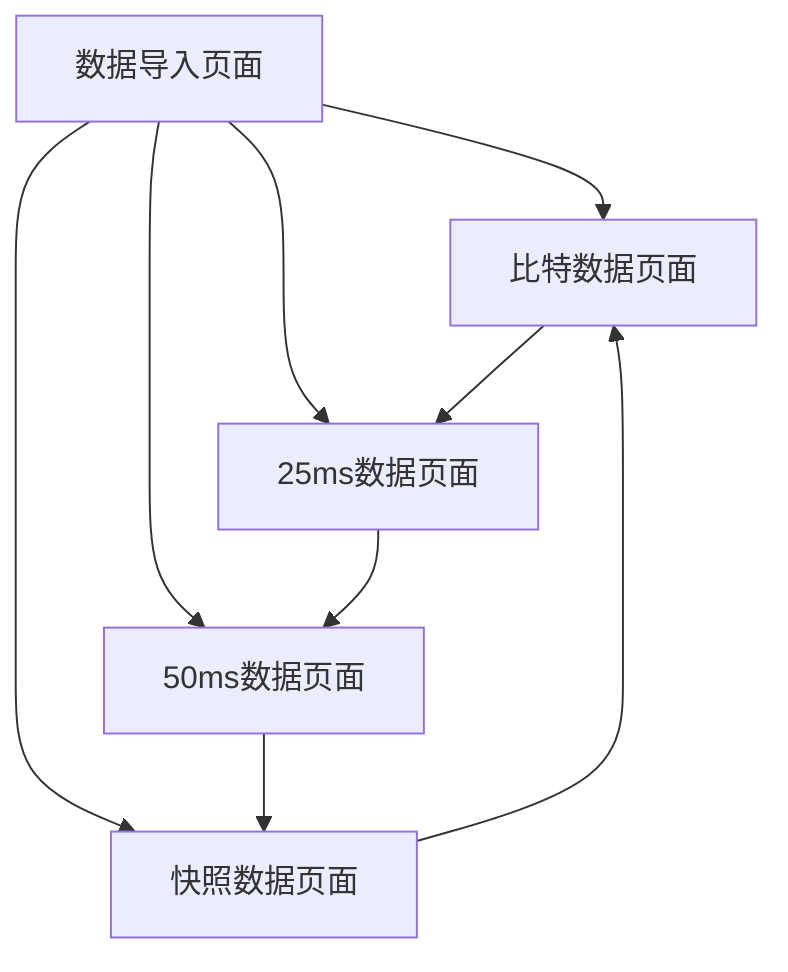

# 电梯控制系统数据跟踪分析工具 - 产品需求文档

## 1. 产品概述

电梯控制系统数据跟踪分析工具是一个专业的数据分析平台，用于处理和分析电梯控制系统的运行数据。该工具能够导入TXT格式的电梯控制数据文件，并将数据分类展示为比特数据、25ms数据、50ms数据和快照数据四个部分，帮助工程师快速定位和分析电梯系统的运行状态和故障信息。

产品主要解决电梯维护工程师在数据分析过程中的效率问题，通过直观的网页界面和结构化的数据展示，大幅提升故障诊断和系统监控的工作效率。

## 2. 核心功能

### 2.1 用户角色

| 角色 | 注册方式 | 核心权限 |
|------|----------|----------|
| 维护工程师 | 直接访问 | 可导入数据、查看所有数据分析结果 |

### 2.2 功能模块

本产品包含以下主要页面：
1. **数据导入页面**：文件上传功能、数据解析状态显示
2. **比特数据页面**：比特信号状态表格、信号解释显示
3. **25ms数据页面**：25毫秒周期数值数据表格、时序图表
4. **50ms数据页面**：50毫秒周期数值数据表格、时序图表
5. **快照数据页面**：系统状态快照表格、关键时刻数据

### 2.3 页面详情

| 页面名称 | 模块名称 | 功能描述 |
|----------|----------|----------|
| 数据导入页面 | 文件上传模块 | 支持TXT文件拖拽上传，显示文件解析进度和状态 |
| 数据导入页面 | 数据预览模块 | 显示导入文件的基本信息和数据段统计 |
| 比特数据页面 | 信号状态表格 | 显示NO顺序、信号反转标记、信号名、信号解释、32位数据 |
| 比特数据页面 | 信号筛选模块 | 支持按信号名、状态值进行筛选和搜索 |
| 25ms数据页面 | 数值数据表格 | 显示25ms周期采样的所有数值数据 |
| 25ms数据页面 | 时序图表模块 | 提供数据的时序变化趋势图表 |
| 50ms数据页面 | 数值数据表格 | 显示50ms周期采样的所有数值数据 |
| 50ms数据页面 | 时序图表模块 | 提供数据的时序变化趋势图表 |
| 快照数据页面 | 快照数据表格 | 显示关键时刻的系统状态快照 |
| 快照数据页面 | 快照对比模块 | 支持多个快照之间的数据对比分析 |

## 3. 核心流程

用户操作流程如下：
1. 用户访问系统首页，点击"数据导入"进入数据导入页面
2. 用户上传TXT格式的电梯控制数据文件
3. 系统自动解析文件，将数据分为控制、比特、25ms数据、50ms数据、快照五个部分
4. 用户通过侧边栏导航切换到不同的数据分析页面
5. 在比特数据页面查看信号状态，结合AuxSubTableItem.xml配置文件显示信号解释
6. 在25ms/50ms数据页面查看数值数据和时序图表
7. 在快照数据页面查看关键时刻的系统状态

## 4. 用户界面设计

### 4.1 设计风格

- **主色调**：深蓝色(#1f2937)作为主色，浅蓝色(#3b82f6)作为辅助色
- **按钮样式**：圆角矩形按钮，悬停时有阴影效果
- **字体**：主要使用微软雅黑，代码和数据使用等宽字体Consolas
- **布局风格**：左侧固定导航栏 + 右侧内容区域的经典布局
- **图标风格**：使用简洁的线性图标，支持数据分析主题

### 4.2 页面设计概览

| 页面名称 | 模块名称 | UI元素 |
|----------|----------|--------|
| 数据导入页面 | 文件上传模块 | 拖拽上传区域，支持文件格式验证，进度条显示解析状态 |
| 数据导入页面 | 数据预览模块 | 卡片式布局显示文件信息，包含时间戳、数据段数量等 |
| 比特数据页面 | 信号状态表格 | 响应式表格，支持排序和筛选，信号状态用颜色区分 |
| 比特数据页面 | 信号筛选模块 | 搜索框和下拉筛选器，实时过滤表格数据 |
| 25ms数据页面 | 数值数据表格 | 分页表格显示，支持列宽调整和数据导出 |
| 25ms数据页面 | 时序图表模块 | 交互式图表，支持缩放和数据点悬停显示 |
| 50ms数据页面 | 数值数据表格 | 分页表格显示，支持列宽调整和数据导出 |
| 50ms数据页面 | 时序图表模块 | 交互式图表，支持缩放和数据点悬停显示 |
| 快照数据页面 | 快照数据表格 | 时间轴式布局，每个快照显示为独立卡片 |
| 快照数据页面 | 快照对比模块 | 并排对比视图，高亮显示差异数据 |

### 4.3 响应式设计

产品采用桌面优先的设计策略，主要面向工程师在PC端使用。支持1920x1080及以上分辨率的最佳显示效果，同时兼容1366x768的基本显示需求。侧边栏在小屏幕下可收缩为图标模式。