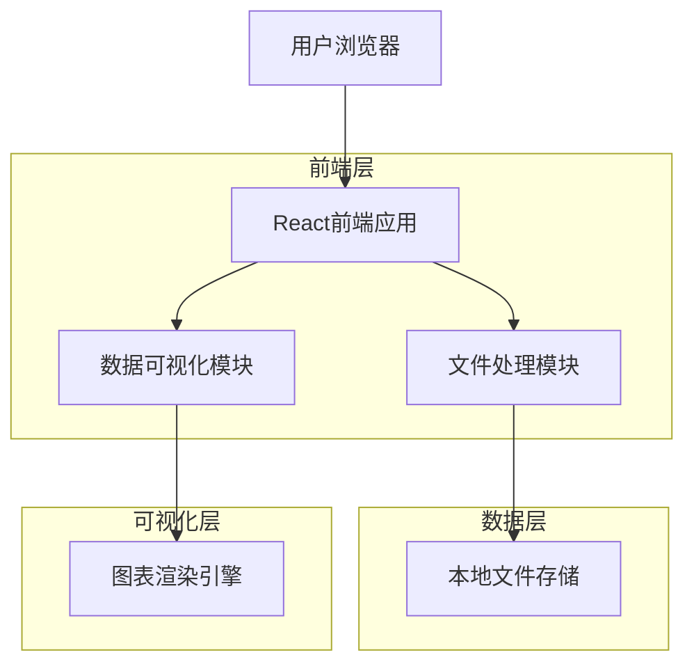
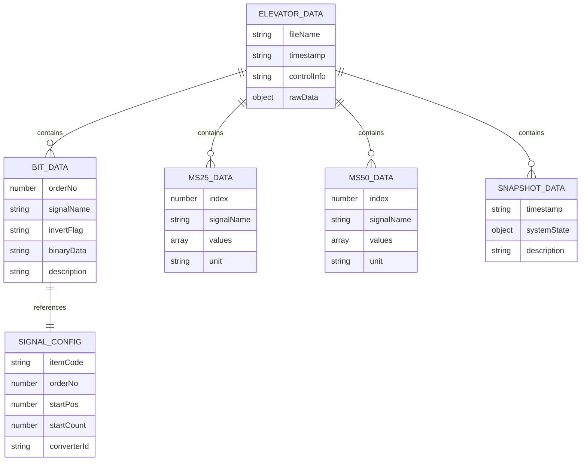

# 电梯控制系统数据跟踪分析工具 - 技术架构文档

## 1. 架构设计



## 2. 技术描述

- **前端**: React@18 + TypeScript + Tailwind CSS + Vite
- **数据可视化**: Chart.js + React-Chartjs-2
- **文件处理**: 原生File API + 自定义解析器
- **状态管理**: React Context + useReducer
- **UI组件**: Headless UI + 自定义组件
- **后端**: 无（纯前端应用）

## 3. 路由定义

| 路由 | 用途 |
|------|------|
| / | 首页，重定向到数据导入页面 |
| /import | 数据导入页面，支持文件上传和解析 |
| /bit-data | 比特数据页面，显示信号状态和解释 |
| /data-25ms | 25ms数据页面，显示数值数据和图表 |
| /data-50ms | 50ms数据页面，显示数值数据和图表 |
| /snapshot | 快照数据页面，显示系统状态快照 |

## 4. 数据模型

### 4.1 数据模型定义



### 4.2 数据类型定义

**电梯数据主结构**
```typescript
interface ElevatorData {
  fileName: string;
  timestamp: string;
  controlInfo: string;
  bitData: BitSignal[];
  ms25Data: NumericData[];
  ms50Data: NumericData[];
  snapshotData: SnapshotData[];
}
```

**比特信号数据**
```typescript
interface BitSignal {
  orderNo: number;
  signalName: string;
  invertFlag: string | null; // "*-" 或 null
  description: string; // 从XML配置文件解析的信号描述
  binaryData: string; // 32位二进制数据
}
```

**数值数据结构**
```typescript
interface NumericData {
  signalName: string;
  values: number[];
  unit?: string;
  timestamp?: string[];
}
```

**快照数据结构**
```typescript
interface SnapshotData {
  timestamp: string;
  systemState: Record<string, any>;
  description?: string;
}
```

**XML配置项结构**
```typescript
interface AuxSubTableItem {
  libId: string;
  tableCode: string;
  orderNo: number;
  startPos: number;
  startCount: number;
  itemCode: string;
  converterId: string;
}
```

### 4.3 数据处理流程

**文件解析器**
```typescript
class ElevatorDataParser {
  parseFile(file: File): Promise<ElevatorData>;
  parseControlSection(content: string): string;
  parseBitSection(content: string): BitSignal[];
  parseMs25Section(content: string): NumericData[];
  parseMs50Section(content: string): NumericData[];
  parseSnapshotSection(content: string): SnapshotData[];
}
```

**XML配置解析器**
```typescript
class XMLConfigParser {
  parseXMLConfig(xmlContent: string): AuxSubTableItem[];
  getSignalDescription(signalName: string, orderNo: number): string;
}
```

**数据存储管理**
```typescript
interface DataStore {
  currentData: ElevatorData | null;
  xmlConfig: AuxSubTableItem[];
  isLoading: boolean;
  error: string | null;
}

type DataAction = 
  | { type: 'SET_DATA'; payload: ElevatorData }
  | { type: 'SET_XML_CONFIG'; payload: AuxSubTableItem[] }
  | { type: 'SET_LOADING'; payload: boolean }
  | { type: 'SET_ERROR'; payload: string };
```